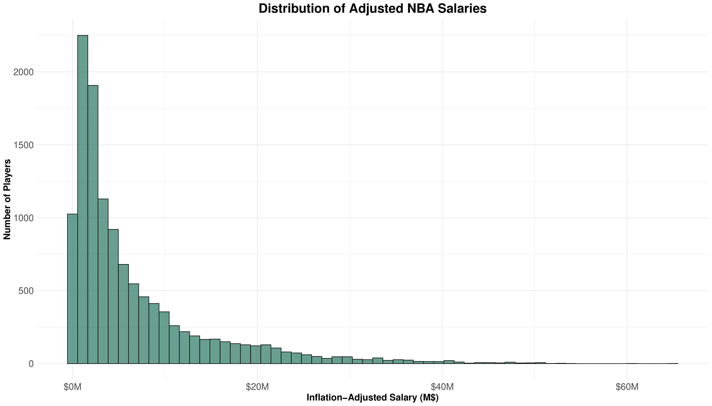
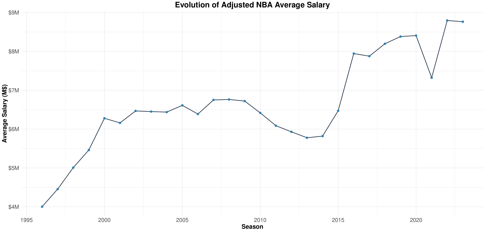
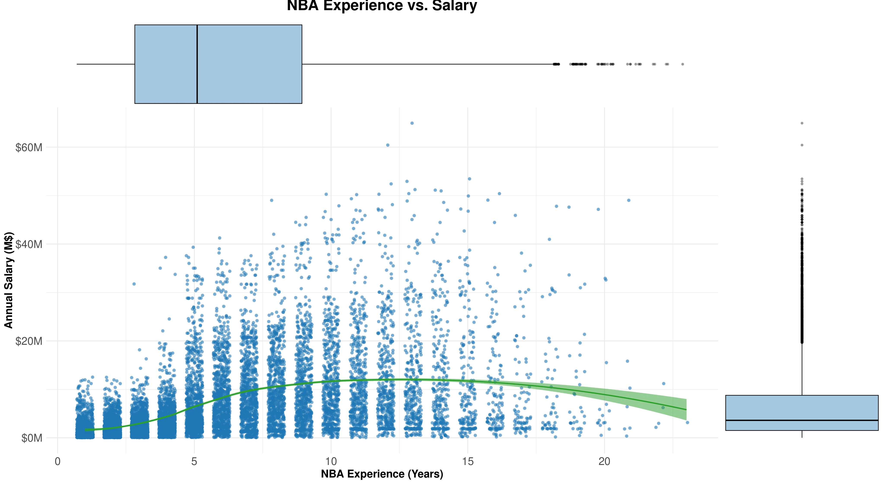
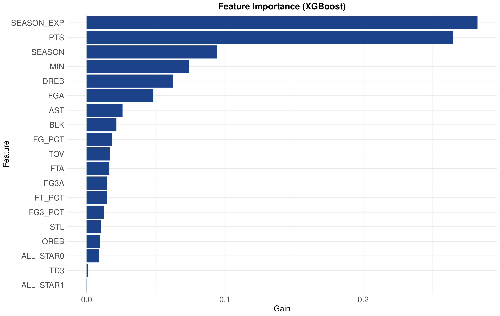
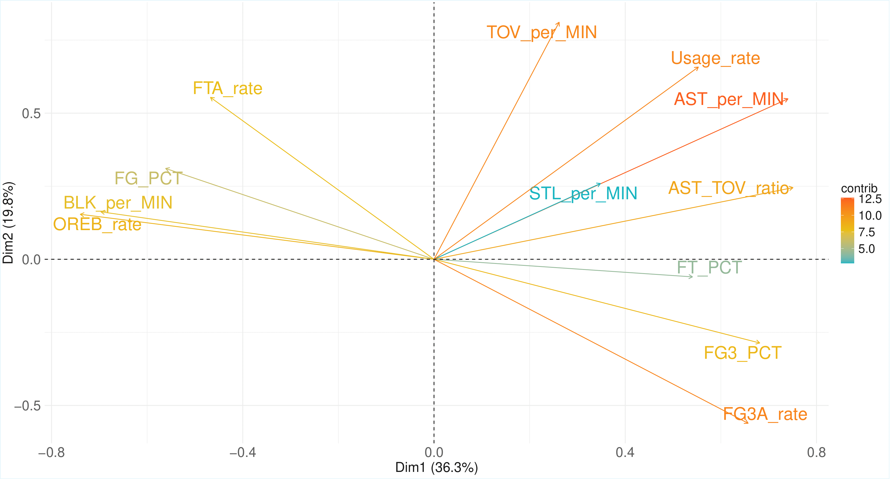
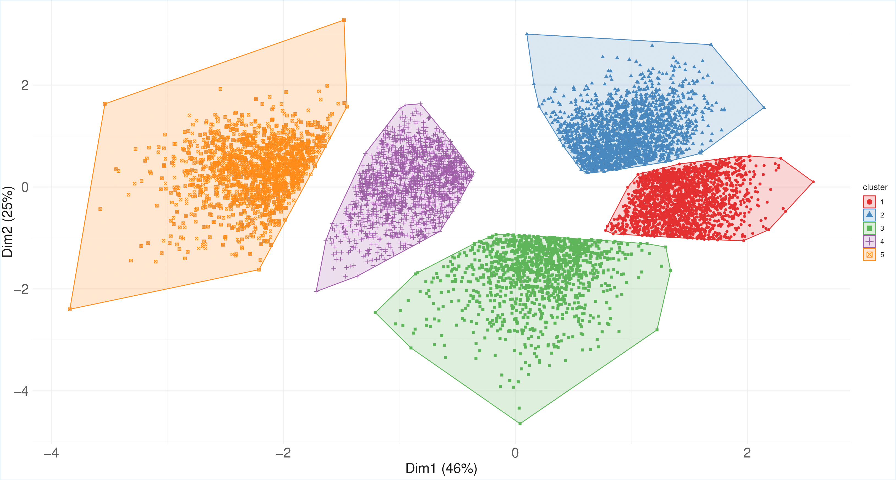
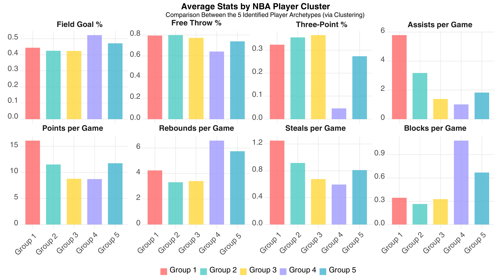
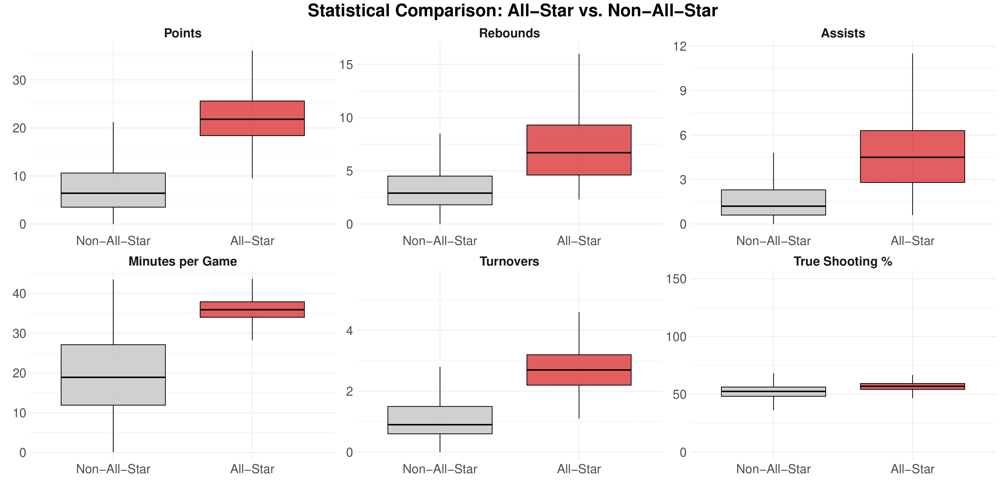
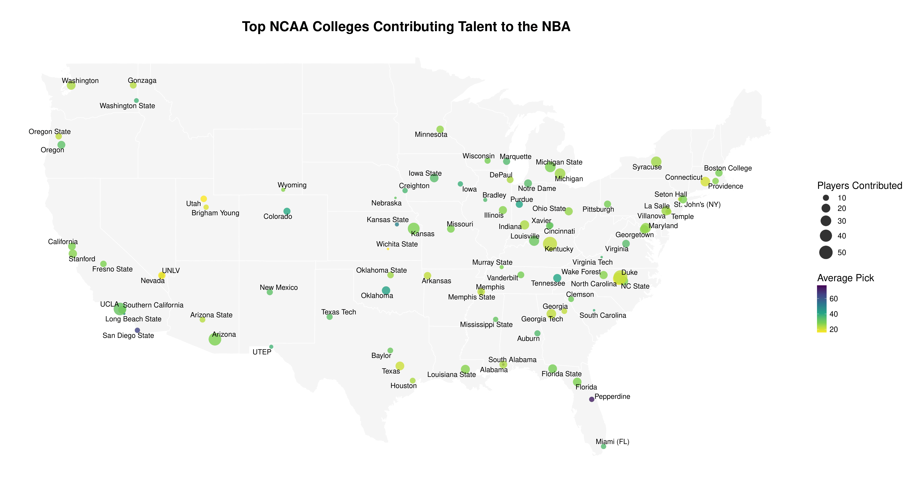
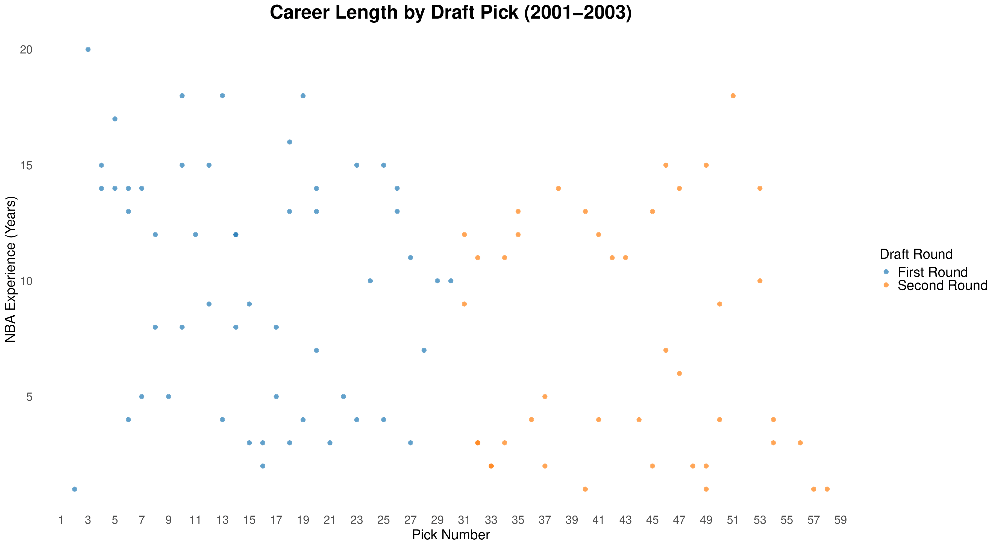

# NBA Player Value and Potential Analysis

This project presents a comprehensive data analysis of NBA players from 1997 until the 2024 season, from their collegiate careers to their performance in the professional league. The goal is to provide data-driven insights into player valuation, game archetypes, and career success prediction.

The project was developed as the final and capstone project for the **Data Analysis** subject of the **Bachelor's Degree in Mathematics** from the **University of Almería** and obtained a grade of **9.8** (out of 10).

This repository contains the full code and documentation for the analysis. The latter is divided into two main reports:

* **Client Report:** A high-level overview of the analysis, focusing on business insights and key findings.

* **Technical Report:** A detailed account of the methodology, models used, and technical results. As well as a full explanation of the code used.

However, this reports are in Spanish, as the project was developed for a Spanish-teached subject. This README file contains the main conclusions and insights from the analysis, as well as a technical breakdown of the methods and technologies used. 

## 1. Project Summary

The NBA, with its rich history of data analytics, serves as an ideal environment for statistical exploration. This project addresses several key questions using a robust dataset compiled from various sources:

* **Salary and Player Value:** What game factors most influence a player's salary? How can we identify overvalued or undervalued players based on their on-court performance?

* **Player Archetypes:** How can we segment players into distinct game archetypes based on their individual statistics?

* **All-Star and Draft Prediction:** Can we predict which players will be selected for the All-Star Game? Can we predict the professional success of a college player in the NBA?

The analysis was performed using **Python** for data extraction and **R** for all data processing, modeling, and visualization.

## 2. Methodology & Key Insights

### 💲 NBA Salary Prediction – Key Findings

This section tackles the most challenging task: predicting NBA player salaries and understanding the game and statistical factors that influence them. Salaries are a complex interplay of performance and macroeconomic factors, including team budgets and market dynamics. In this analysis, we focus on the on-court performance metrics that can be quantified and modeled, by doing so, we aim to provide a clearer picture of player value and identify potential undervalued or overvalued players just based on their performance. 

This information can be crucial for teams to make informed decisions about player contracts and for players to understand their market value.

#### Data Preparation
- Salaries were adjusted for inflation to ensure comparability across seasons.
- A rigorous feature selection process was followed, excluding variables that introduced noise or multicollinearity (e.g., physical attributes, team performance metrics like plus-minus).
- Fantasy points were excluded due to their dominant influence and negative impact on model interpretability.
- Position, personal fouls, and similar variables were discarded for their low predictive value.
- Experience and All-Star status were included as categorical variables; season was treated as numeric for better performance.
- Outliers and non-active players were filtered out to ensure prediction reliability

#### Exploratory Data Analysis (EDA)
The EDA revealed several key insights. First, the distribution of salaries is highly skewed, with a few players earning significantly more than the majority. This skewness suggests that while some players are overvalued, many are undervalued relative to their performance.

  

At the same time, the analysis showed that player salaries have been increasing over time, reflecting the growing financial power of the NBA and its franchises as well as the impact of macroeconomic factors like inflation and TV deals that have inflated player salaries across the board.

  

Lastly, the analysis highlighted the importance of experience and performance other performance metrics in determining player salaries. Concretly, we can see that players with more experience and better performance metrics tend to earn higher salaries, but there are exceptions where players with less experience or lower performance metrics earn high salaries due to other factors like marketability or team needs.

  

#### Modeling

We use **XGBoost**, a powerful decision tree-based algorithm known for its accuracy and flexibility in regression tasks.

##### Model Performance
- **R²:** 0.754  
- **Adjusted RMSE:** \$4,067,611  
- **Adjusted MAE:** \$2,870,036  

The model explains ~75% of the salary variance—quite effective considering the complexity of salary determinants, which can be considered a success in the context of sports analytics taking into account the many external factors that influence player salaries. 

Although the MAE is around \$2.9 million, which is significant, we can take some predictions from our test set as examples of the model's performance and its ability to identify over- and undervalued players:

- Stephen Curry (2012–13 Season): The model predicts Curry’s salary with an error of just $81,066 against his actual $5.42 M contract—an astonishingly low 0.015 % error. This is one of the best cases of model accuracy.

- Zion Williamson (2022–23 Season): As a young player in his third year earning $14.4 M, the model misses by only $283,000 (0.020 %). This impressive precision holds even in the face of a major contract jump.

- Mike Conley (2017–18 Season): Conley earned $36.5 M, but the model predicts about $22.5 M—undershooting by $14 M. This large gap highlights an overinflated contract at the time; today his salary is $9 M, underscoring how the model can flag overvaluation.

- Jamal Crawford (2003–04 Season): Crawford made $4.4 M, yet the model forecasts around $11 M. Given his four years of experience and a 17 PPG average, he was arguably one of the league’s top point guards then. Indeed, his salary rose to $9 M the next year and matched the $11 M estimate two seasons later—an example of a player initially undervalued.

- Shaquille O’Neal (2008–09 Season): The model errs by $4.3 M on O’Neal’s $30.02 M salary—a seemingly large absolute error that nevertheless remains below a 15 % relative error, especially reasonable for an All-Star at the peak of his career.

  

**Most important features:** Experience, points per game, season, minutes played, rebounds, assists, and shooting accuracy.

Surprisingly, All-Star status had minimal weight, likely because performance stats indirectly capture that influence.

### 🏀 Player Archetypes – Key Findings

This section applies unsupervised learning and dimensionality reduction techniques to identify distinct player archetypes in the NBA, going beyond traditional positions which EDA already showed to be too broad and not representative enough of the many roles players can perform on the court.

This segmentation allows us to move beyond basic stats or position labels and understand player styles in a more data-driven, nuanced way. This can be of great value for scouting teams.

#### Feature Engineering and Data Preparation

To make comparisons fair and focused on style rather than volume, standard per-game stats were transformed into **per-minute** metrics and advanced ratios. These include:

- **Shooting tendencies**: `FGA_per_MIN`, `FG3A_rate`, `FTA_rate`
- **Rebounding style**: `OREB_rate`
- **Playmaking and efficiency**: `AST_per_MIN`, `TOV_per_MIN`, `AST_TOV_ratio`
- **Defensive contribution**: `STL_per_MIN`, `BLK_per_MIN`
- **Estimated usage**: `Usage_rate` (combining FGA, FTA, AST, TOV per minute)

Players with fewer than 15 minutes per game were filtered out to ensure role players and stars were both represented fairly.

#### Modeling

##### Dimensionality Reduction (PCA)

The transformed data was scaled and reduced using PCA. The first three components explained ~60% of total variance. The variable loadings showed logical groupings, capturing diverse aspects of gameplay (shooting, defense, playmaking).

The next step was to visualize these components to understand how they relate to player styles. The PCA biplot revealed clear clusters of players based on their statistical profiles, with each component representing different aspects of gameplay.

  

##### Clustering

The first three principal components were used for **K-means clustering**. Using the elbow method, **5 clusters** were selected as optimal. This is the result projected onto the first two PCA components:

  

Now, we can analyze the clusters to identify distinct player archetypes based on their statistical profiles. The clusters were visualized using `factoextra` and `ggplot2`, revealing clear groupings of players with similar styles. 

  

Each cluster revealed a meaningful player type based on statistical behavior rather than position:

1. **Playmakers – Hybrid Guards & Forwards**  
   High assist and steal rates, versatile scorers.  
   *Examples:* Jason Kidd, Allen Iverson, Kobe Bryant, LeBron James, Stephen Curry, Nikola Jokić (surprisingly, due to his playmaking).

2. **Versatile Guards**  
   Strong perimeter shooters with balanced stat profiles.  
   *Examples:* Michael Jordan, Ray Allen, Damian Lillard, Klay Thompson.

3. **3-Point Role Players**  
   Bench players who excel in spot-up shooting and floor spacing.  
   *Examples:* Danny Green, Kevin Love (late career), Dirk Nowitzki (late career), JR Smith.

4. **Classic Big Men**  
   Centers focused on defense, rebounding, and paint efficiency.  
   *Examples:* Shaquille O’Neal, Tim Duncan, Yao Ming, Pau Gasol, Dwight Howard.

5. **Defensive Hybrids**  
   Players with notable defensive contributions and occasional perimeter scoring.  
   *Examples:* Vince Carter, Kevin Garnett, Pau Gasol, Nikola Jokić (again, due to versatility).

### ⭐ All-Star Prediction

This section focuses on predicting NBA All-Star selections using a **Random Forest classifier**. Being named an All-Star is a prestigious achievement for players, and the ability to predict this can be valuable for betting platforms or brands seeking to sponsor rising stars.

Despite clear performance differences between All-Star and non-All-Star players, this binary classification task is challenging due to:

- **Class imbalance**: Far fewer All-Stars exist compared to non-All-Stars, which can bias models toward predicting the majority class.
- **Temporal dependency**: Only 24 All-Stars are selected each season, so the year must be included as a feature.

#### Exploratory Data Analysis (EDA)

Since the EDA we can notice that All-Stars tend to have higher points, assists, and rebounds per game, as well as better shooting percentages. Consequently, we can differentiate All-Stars from non-All-Stars based on these performance metrics most of the time, but the model must also account for the class imbalance and temporal dependencies.

  

#### Modeling

The model is trained using the `caret` R package with cross-validation to optimize hyperparameters. After extensive testing, a Random Forest with **250 trees** and **2 random variables per split** performed best. The **AUC (Area Under the Curve)** is used as the main evaluation metric due to the class imbalance.

**Key results on the test set:**

- **Accuracy**: 96.48%
- **Precision (All-Star)**: 65%
- **Recall (All-Star)**: 81.81%
- **F1 Score**: 0.72

These metrics show that the model effectively identifies most true All-Stars while maintaining a reasonable balance between false positives and false negatives. The default threshold of 0.5 yielded the best F1 score.

### 🎓 Draft Success Prediction

Each year, NBA franchises select top NCAA players through the **NBA Draft**. While some draftees go on to have long, successful careers, others struggle and leave the league within just a few years.

The aim of this section is to show some insights into the **draft process** and to see whether it's possible to **predict the long-term success** of a drafted player using only **college statistics**. Success is defined as playing more than **5 years** in the NBA. A predictive model like this could help teams identify hidden gems and build more data-driven draft strategies.

#### Exploratory Data Analysis (EDA)

The dataset includes about **1,500 drafted players** from 1980 to 2017, with some missing values—especially for older players. 

First, we can build a university map to visualize the colleges that produce the most successful players.

  

**Top contributing universities:**  
Duke, Kansas, Kentucky, Arizona, and UCLA stand out. In contrast, universities like Nebraska or Virginia have contributed very few players.

**Best average draft picks:**  
Texas, Duke, Kentucky, Utah, and UNLV have some of the highest average pick positions. Others, like San Diego State or Pepperdine, tend to place players in later rounds.

The data was processed using `dplyr` to group players by university and calculate averages. Then, `tidygeocoder` was used to geocode university names into coordinates for mapping.

On the other hand, a scatterplot analysis of the 2001–2003 draft classes shows that high picks do not guarantee long NBA careers. Many second-round picks went on to play 10+ years, suggesting the presence of hidden gems in the draft.

  

Other analysis show that most draftees were Seniors. However, contrary to intuition, **Juniors tend to have the longest NBA careers (avg. 8.3 years)**, while Seniors average only 6.5 years. This may indicate that standout players are often drafted earlier, while Seniors may represent last-chance attempts to enter the league.

#### Modeling

We will build a **XGBoost** model, a powerful algorithm that can handle missing data and works well with small datasets like ours.

After selecting relevant variables and converting categorical features to numerical ones, hyperparameters are tuned using the `caret` package and cross-validation. Due to caret’s limitations with missing data, the final model is trained using the optimal parameters with the native `xgboost` package.

**Results from the confusion matrix:**

|                | Predicted: No Success | Predicted: Success |
|----------------|-----------------------|---------------------|
| **Actual: No Success** | 57                    | 38                  |
| **Actual: Success**    | 47                    | 159                 |

- **Accuracy**: 71.76%
- **Precision (Success)**: 77.18%
- **Recall (Success)**: 80.71%
- **F1 Score**: 0.79

The model performs reasonably well, especially considering that it relies solely on **pre-draft college data**. Notably, the **draft pick number** was not used as a feature to preserve the model’s usefulness in real scouting contexts. However, the **draft round** was included, as it’s typically projected before the draft takes place.

The feature importance plot reveals that:
- **Draft round** and **True Shooting %** are among the most predictive variables.
- **Academic class** also plays a role in success prediction.

## 3. Technical Breakdown

### **Data & Methodology**

Data was scraped with the Python library `BeautifulSoup4` from various sources like *HoopsHype* or *Wikipedia* and using other tools like the `nba_api` and *Stathead*. 

The entire analysis was then performed in R, leveraging the following key techniques:

* **Data Wrangling:** Extensive data cleaning and joining of multiple datasets (player stats, salaries, college data) to create a unified and robust analytical base.

* **Exploratory Data Analysis (EDA):** Visual exploration of salary distributions, player metrics, and the relationship between collegiate performance and professional success in order to identify trends and patterns that can be useful for modeling.

* **Predictive Modeling:**

    * **Salary Prediction:** Used an **XGBoost** regression model to predict player salaries, allowing for the identification of over- and undervalued players.

    * **All-Star Prediction:** Employed a **Random Forest** classification model to predict All-Star selections, addressing the challenge of imbalanced data.

    * **Draft Success Prediction:** A **XGBoost** classification model was used to predict player success (defined as 5+ years in the league) based on their college statistics.

* **Clustering:** Applied PCA and then k-means clustering to segment players into different game archetypes based on their statistical profiles. 

**Key Packages** : `ggplot2`, `dplyr`, `tidyr`, `caret`, `xgboost`, `randomForest`, `factoextra`, `corrplot`, and others.

### **Reproducibility**

The project environment is managed using the `renv` package to ensure full reproducibility. To run the project locally, simply clone the repository and run `renv::restore()` to install the correct package versions.

For running the Python scripts, ensure you have the necessary libraries installed, these can be found in `requirements.txt`.

### **Project Structure**

* `src/`: Contains all the source code for the project.

    * `src/Python/`: Contains Python scripts for data extraction and scraping.

    * `src/R/`: Contains R scripts for data processing, analysis, and modeling.

* `reports/`: Contains the Spanish PDF versions of the reports.

    * `client_report.pdf`: A high-level report with key business insights and visualizations.

    * `technical_report.pdf`: A detailed technical report of the methodology, models, and results.

* `data/`: Contains the raw and processed datasets obtained after the extraction process.

* `outputs/`: Contains the output files generated by the analysis, including visualizations and model results.

